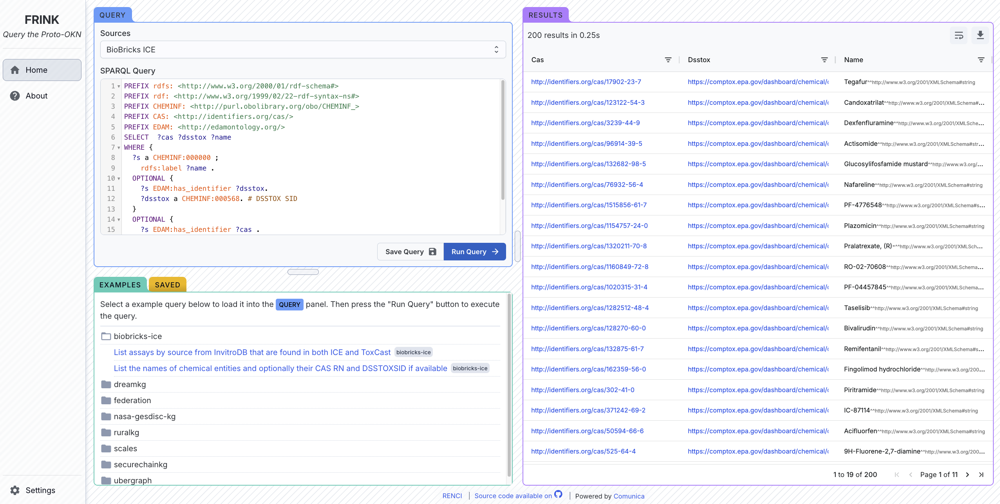
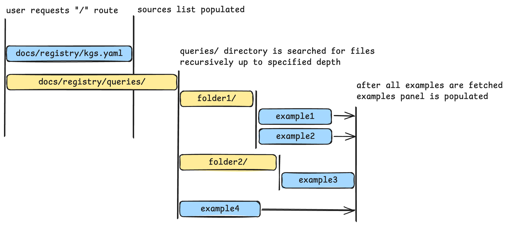

# FRINK Query UI

This repository contains the code for the FRINK Query UI web app, which can be used to query the Theme 1 [Proto-OKN](https://www.proto-okn.net/) knowledge graphs or the FRINK federated knowledge graph.

- **[FRINK Query UI](https://frink.apps.renci.org)**
- [FRINK website](https://frink.renci.org/)
- [Proto-OKN website](https://www.proto-okn.net/)



# Development

1. Ensure you have an up-to-date version of [Node.js](https://nodejs.org/en/download) installed on your system.
2. Clone the repo and navigate to the directory.
3. Install all dependencies using the command `npm install`.
4. Create a `.env.local` text file in the root of the project directory and copy the environment variables listed under the "Environment Variables > Required" section below.
5. When finished, run the development server with `npm run dev`. The script should automatically open a browser tab at [http://localhost:5173](http://localhost:5173). Any changes you make in the code and save will update the development preview.

## Environment Variables

### Required

Make sure the following variables are set when the site is built. For local development, create a `.env.local` to have variables automatically loaded by Vite.

```
VITE_GH_REPO=frink-okn/okn-registry
VITE_GH_SOURCES=/docs/registry/kgs.yaml
VITE_GH_EXAMPLES_DIRECTORY=/docs/registry/queries
```

These environment variables handle where the site will pull the dynamic data required for the source selector and examples panel. See [Fetching Data from OKN registry](#fetching-data-from-okn-registry) for more information.

### Optional

`VITE_TANSTACK_BASE_URL`: if set to a string, will add a global base url route to all paths. Use this if you're not deploying to a domain at the root route (`/`)

`VITE_GH_TOKEN`: All of the Github directory queries (for the examples) are done using the [Github API](https://docs.github.com/en/rest/repos/contents?apiVersion=2022-11-28#get-repository-content). With no authentication, this endpoint is ratelimited to ~60 req/hr. If you supply your access token ([instructions](https://docs.github.com/en/authentication/keeping-your-account-and-data-secure/managing-your-personal-access-tokens#creating-a-fine-grained-personal-access-token)) in this environment variable it will be used instead. This can be useful for development.

## Tools and Libraries Used

- [npm](https://www.npmjs.com/): package manager, bundled with [Node.js](https://nodejs.org/en/download) runtime
- [Vite](https://vite.dev/): development server, bundling (esbuild + Rollup)
- [React](https://react.dev/): reactive UI library
- [Typescript](https://www.typescriptlang.org/): Javascript superset providing compile-time strong typing
- [Tanstack Router](https://tanstack.com/router): client-side page router
- [Tanstack Query](https://tanstack.com/query/): query state manager
- [Comunica](https://comunica.dev/docs/query/getting_started/query_app/): SPARQL query engine
- [Yasqe](https://github.com/TriplyDB/yasgui): syntax-highlighted SPARQL editor component
- [Joy UI](https://mui.com/joy-ui/getting-started/): React-based UI component library
- [AG Grid](https://www.ag-grid.com/): React data table component
- [react-resizable-panels](https://github.com/bvaughn/react-resizable-panels): React draggable panels component
- [valibot](https://valibot.dev/): runtime schema validator
- [react-aria](https://react-spectrum.adobe.com/react-aria/index.html): React-based unstyled components for common UI patterns

## Querying the Knowledge Graphs

The actual work of querying the SPARQL and TPF endpoints is mostly handled by Comunica, but is wrapped in a thin [`useComunicaQuery`](./src/hooks/useComunicaQuery.ts) hook that assists in integrating it with React UI code (loading state, errors, etc). Refer to the Comunica documentation for a deeper understanding of its features and usage.

Additionally, there is a small [React Context](https://react.dev/learn/passing-data-deeply-with-context) in [`/context/query.tsx`](./src/context/query.tsx) that provides the values from the `useComunicaQuery` hook to any component that needs it in the app (both the query editor and results table need access to the same data). The context also adds a timer that is automatically started while the query is running and displayed in the results panel.

## Fetching Data from OKN registry

A lot of the configuration for this application is fetched at run-time when a user visits the website. This prevents the application from needing to re-built when some information about the knowledge graph changes (i.e. a new graph is added, or an example is modified). All of the metadata about the current state of the OKN graphs are documented in a structured format in the [registry repo](https://github.com/frink-okn/okn-registry/tree/main/docs/registry).

Of particular use in this application are the [`kgs.yaml`](https://github.com/frink-okn/okn-registry/blob/main/docs/registry/kgs.yaml) and the [`queries/`](https://github.com/frink-okn/okn-registry/tree/main/docs/registry/queries) directory.

### `kgs.yaml`:

This is an array of all the sources that is used to populate the [`SourceSelect.tsx`](./src/ui/SourceSelect.tsx) dropdown. The code that parses and transforms this file is defined in [`data/sources.ts`](./src/data/sources.ts). In order for the source to be shown in the dropdown, it must have the following keys:

- title
- shortname
- sparql
- tpf

Furthermore, the sources are grouped together by type in the dropdown, which is hardcoded in a map defined in the `sources.ts` file. If a source is in the `kgs.yaml` file but not in the map, it will be listed under the "Other Graphs" group.

The `source.ts` file exports a `fetchSources` function. This function is called by the router in the [`routes/__root.tsx`](./src/routes/__root.tsx), ensuring the page doesn’t render until the sources have been fetched (this typically happens in less that 50ms). Once that data has been fetched, it can be referenced anywhere else in the app by calling the `rootRouteApi.useLoaderData()` hook provided by the router.

### `queries/` (Examples):

> [!IMPORTANT]
> If you are a maintainer looking to add or update the example queries, follow the step-by-step guide [here](https://frink.renci.org/help/update-queries/).

This is a directory that contains arbitrary directories and `.rq` SPARQL files. It's used to store the sample SPARQL queries. Each `.rq` file contains a YAML frontmatter section at the start of the file, before the SPARQL code. It's formatted with `#+ ` before each line.

```
#+ summary: This is an example query
#+ tags:
#+   - biobricks-ice
```

_Every `.rq` file needs a string summary and an array of tags representing the source(s) to use (matching the `shortname` tag in `kgs.yaml`)_

The [`data/examples.ts`](./src/data/examples.ts) code contains a `fetchExamples` function that fetches the all of the `.rq` files recursively and generates a Javascript object that mirrors the file structure tree. The actual code that manages traversing the `queries/` directory on Github's server is defined in [`data/github-utils.ts`](./src/data/github-utils.ts). The tree structure is built to support the [`ExampleTree.tsx`](./src/ui/ExampleTree.tsx) component that displays a file tree UI.

> [!WARNING]
> The `getFilesFromGithub` function has a default maxDepth of 2. The more levels of nesting the `queries/` directory contains, the longer the network request waterfall will take. It is recommended to keep `queries/` directory fairly flat to keep the load times low.

Because the examples data fetching requires using the Github API once for each folder, it's possible for a user constantly refreshing the page to hit the API limit. To avoid this, the query state management library is set up to cache the return value from `fetchExamples` for 24hrs. Additionally, the localStorage adapter from [@tanstack/query-sync-storage-persister](https://tanstack.com/query/v4/docs/framework/react/plugins/persistQueryClient) is used as the backing store for the cache so that refreshes to the page pull the examples from localStorage if they haven't expired. For maintainers or developers testing the examples, a "Invalidate example queries cache" button can be found on the settings page in the application.

### Simplified Page Load Network Diagram



The above diagram gives a simplified view of the network requests made when the user loads the page. The yellow boxes are using the Github API to fetch the contents of the directory. Once files have been found, the `raw.githubusercontent.com` url can be used to directly fetch the contents of the file (blue boxes, these are not subject to the rate limit). Note the possibility of network waterfalls for deeply nested folders in `/queries`. In the UI, the text "Loading..." will be shown until the all the request have finished.
